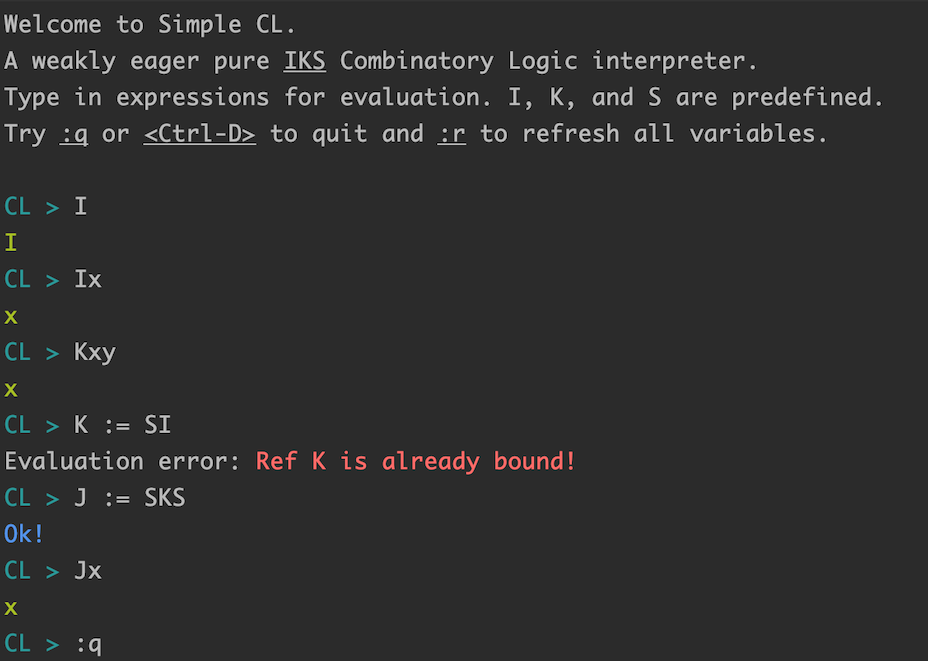

# Simple Combinatory Logic and Lambda Calculus in Scala

This is a humble attempt to learn Combinatory Logic and Lambda Calculus
by implementing a simple ADT + DSL for CL Terms and Term reduction in
Scala as well as an AST, an interpreter, and a REPL.

The terminology, theorems and lemmas are taken from
`Lambda-Calculus and Combinators, an Introduction` by `J. Roger Hindley`
 and `Jonathan P. Seldin`, `Cambridge University Press 2008`.

## REPL
You can run the REPL using `sbt run`.

```
> sbt run
```



Variables must have a single lower case letter as their name.
`x`, `y`, `z` are valid variable names.

Terms names must be a single upper case letter followed by any number of
single quotes. `M`, `M'`, `S''` are all valid names for Terms.

Here are some of the basic things you can do in the REPL:

- In order to define a new CL Term use the `:=` notation:

```
CL > M := SII
```

- You can't rebind/re-assign an existing term but you can clear
all defined terms with the `:r` REPL command.

- Once a term is defined you can use it in later expressions:

```
CL > Mx
xx
```

The second line in the above example is the result of evaluating the
expression. An eager weak reduction strategy is used for evaluation.

- For abstraction use the bracket syntax (don't forget the dot after
the bracket). Abstracting over multiple variables, or nesting
multiple abstractions (right-associative) is also supported:

```
CL > [x,y,z].xz(yz)
S
CL > [x].[y].[z].xz(yz)
S
```

Abstractions are valid expressions so you can assign them to new
terms but as abstraction is not part of the CL syntax you can't
use it within a term itself. For instance the following won't work:

```
CL > ([x,y].y)uv
Compile error ...
```

You can first assign the abstraction to a new term to force the
evaluation and then use it in future expressions.

```
CL > K' := [x,y].y
Ok!
CL > K'uv
v
```

- For substitution use the bracket syntax.

```
CL > [y/x]x
y
```

For now only single substitution is supported at the language,
 although the ADT DSL supports simultaneous substitution. Nested or
 sequential substitution is supported though (and associates to right)

```
CL > [SS/x][xx/y]yz
Sz(SSz)
```

Just like abstraction, you can't use the substitution bracket syntax
in a term. You can assign the result of a substitution to a new term
though.

```
CL > N := [SS/x][xx/y]yz
Ok!
CL > Na
za(Sa(za))
```

- You can add a comment after an expression. Start the comment with a
hash sign:

```
CL > Q := KI   # Kite combinator
Ok!
```

Note: Comments can't span multiple lines and whole line comments are not
supported.

### REPL Directives
REPL directives start with a dash `-`. Here is a list of supported
directives:

  - `-abs:primitive`: changes the abstraction strategy to primitive, aka
  Curry's algorithm fab).
  - `-abs:weak`: changes the abstraction strategy to weak, aka
  Curry's algorithm abf).
  - `-abs:eta`: changes the abstraction strategy to eta, aka Curry's
  algorithm abcf. This is the default strategy.

Here's an example of directives in action:

```
CL > [x,y,z].xz(yz)
S
CL > -abs:weak
Ok! Abstraction strategy changed to Weak Abstraction.
CL > [x,y,z].xz(yz)
S(S(KS)(S(KK)(S(KS)(S(S(KS)(S(KK)I))(KI)))))(K(S(S(KS)(S(KK)I))(KI)))
CL > -abs:primitive
Ok! Abstraction strategy changed to Primitive Abstraction.
CL > [x,y,z].xz(yz)
S(S(KS)(S ... A very long term ... K)(KI)))
```

## Project Structure
  - `cl-core`: CL ADT and DSL are implemented in this sub-project.
  - `cl-lang`: A Mini CL Language with a parser and AST.
  - `cl-eval`: An evaluator (interpreter) for the Mini CL language.
  - `cl-repl`: REPL for the Mini CL language.
  - `lambda-core`: Lambda Calculus ADT and DSL.

## CL Term ADT

### CL ADT Basics
The CL `Term` ADT is implemented in the package object `cl`.
So you will need the following import everywhere:

```scala
import cl._
```

### CL First Sample

```scala

import cl._

val (x, y, z) = (Var('x'), Var('y'), Var('z'))
val Kx        = K(x)
val Kxy       = Kx(y)
val K_xy      = K ^ x(y)

val shouldBeTrue = x ⊆ Kxy
val l            = Kxy.length

val freeVars     = K_xy.FV
```

### Variables
As the literature suggests, variables must have a lower case letter as
their name.

```scala
import cl._

val x = Var('x')
val y = Var('y')
```

### Basic Combinators
The three musketeers, aka basic combinators `I`, `K`, and `S`, are
predefined.

```scala
import cl._
val x = Var('x')
val y = Var('y')

val N = I(x)           // Ix
val M = K(x)(y)        // Kxy
val U = S(K)(S)        // SKS
```

### Application
We are in the Untyped Combinatory Logic land so any `Term` is
applicable to any `Term`.

You can use the DSL in one of the following ways:
  - the `apply` function as in `K(S)`
  - the left-associative `^` operator as in `K ^ S`
  - the right-associative `^:` operator as in `K ^: S ^: M`. This is
  exactly like the `$` operator in Haskell.

```scala
import cl._
val x = Var('x')
val y = Var('y')

val M = S(K)(S)                // SKS
val N = S ^ K(S)               // S(KS)
val P = S ^: K ^: S(K)         // S(K(SK))
val U = K(I) ^: S(S)           // KI(SS)
```

Scala's spec gives higher precedence to the `^` and `^:` operators.
The `apply` and the `^` will both be left associative, just like the
 convention used in the CL literature.
`^` and `^:` can be used to avoid parenthesises in some cases.

```scala
val H = S(K)(I)(K(S(S)))
val E = S(K)(I) ^ (K ^ S(S))       // Same thing, more readable
```

#### Pattern Matching on Term ADT
Pattern matching (aka induction on the structure of the CL Terms) is
the essence of most Combinatory Logic theorems and algorithms.

```scala
   M match {
     case Var(x) ⇒ ...                 // Variables
     case _U ^ _V ⇒ ...                // Application of term _U to _V
     case BasicCombinator(name) ⇒  ... // one of I, K, S
   }
```

One can also match on `I`, `K`, and `S` directly:

```scala
  M match {
    case I ⇒ ...
    case K ⇒ ...
    case S ⇒ ...
    case _ ⇒
  }
```

Note: due to Scala's spec, the following pattern does not work:

```scala
  ...
  case M ^ N ⇒ ... // Wrong, value patterns can't begin with uppercase
  ...
```

and it's not a good idea to use lower case names for CL Terms, hence the
underscore workaround:

```scala
  ...
  case _M ^ _N ⇒ ... // Ok! Underscore is fine
  ...
```

## Compiler
The mini CL language is implemented in the `lang` sub-project.
Here's how to parse a mini CL statement to AST:

```scala
import cl.compiler.{CLCompileError, Compiler}
import cl.compiler.ast.AST

val statement = "SKI"
val result: Either[CLCompileError , AST] = CLCompiler(statement)
```
